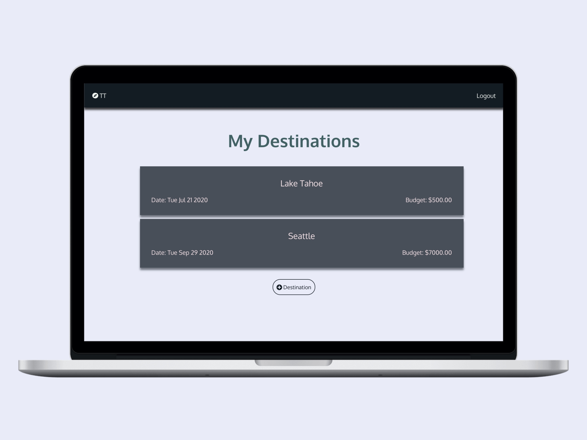
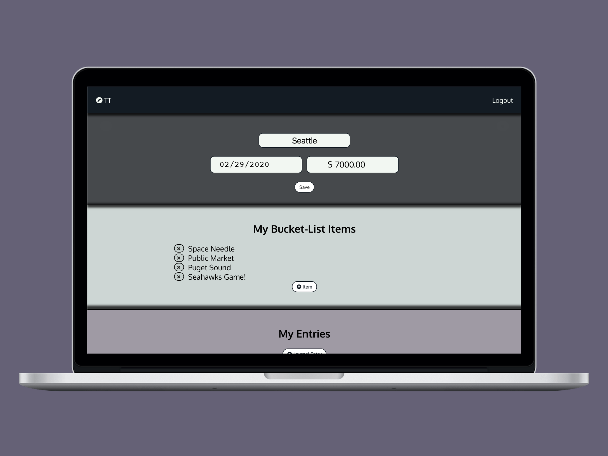
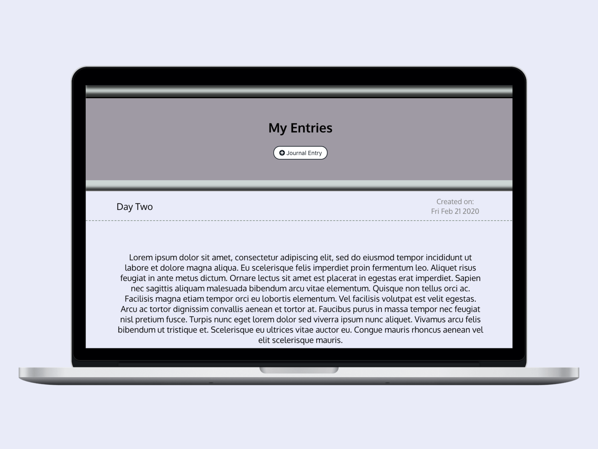

## Thoughtful Travels
Thoughtful Travels is a web application for users to set destination travel goals and reflect on their experience. 

Thoughtful Travels aims to empower it’s users by giving them a place to organize their travel goals, set specific details on their goals and reflect on their experiences so the invaluable memories from their travels are documented.

## Login 
You can create your own account or login using:  
username: john_doe  
password: Jd#1234

Have fun playing around on Thoughtful Travels! 

## Deployed App: 
https://thoughtful-travels-7oleygwkt.now.sh  
https://jc-t-travels.now.sh/

## Tech Stack:
- Javascript
- React
- Node
- Express
- Knex

## Server side: 
Repo: https://github.com/jordanxcast/thoughtful-travels-server

## Screenshots: 

