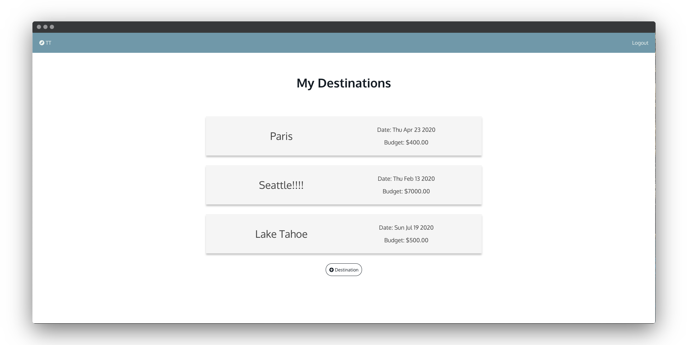
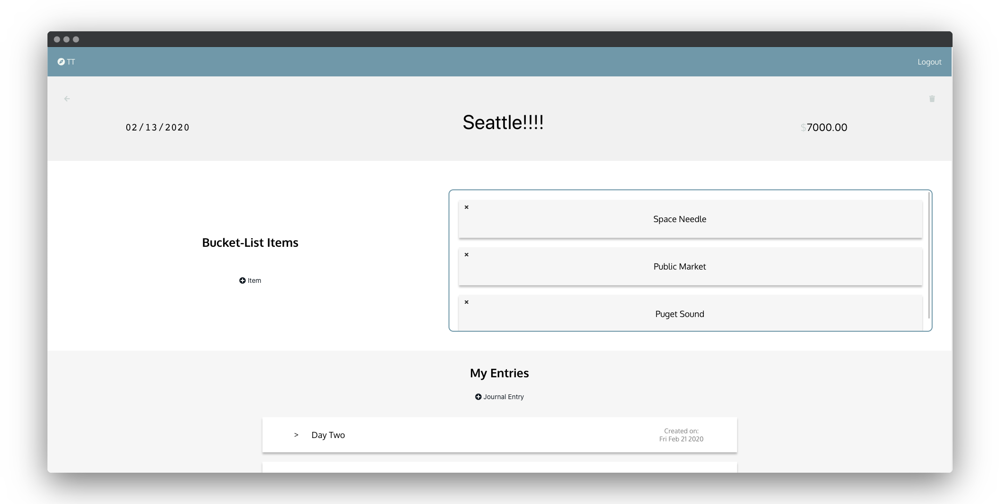
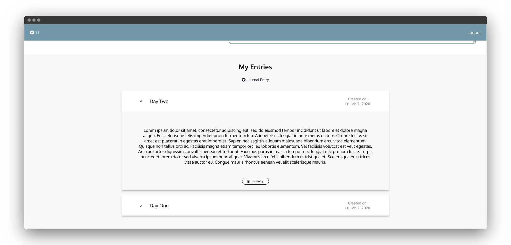

## Thoughtful Travels
Thoughtful Travels is a web application for users to set destination travel goals and reflect on their experience. 

Thoughtful Travels aims to empower it’s users by giving them a place to organize their travel goals, set specific details on their goals and reflect on their experiences so the invaluable memories from their travels are documented.

I created Thoughtful Travels after going on a trip to Europe with my father. We sent two weeks traveling to different cities, eating amazing food and meeting the most incredible and diversed people. By the second week, we would think back to our first day and actually not be able to remember parts of the day or even the past week. I thought, how could I be on the most incredible trip and not recall it all? I asked around to other people who travel frequently and I discovered this is a common problem. Thus, the idea of Thoughtful Travels was born. A space to document your trips and the experiences you make. 

## Login 
You can create your own account or login using:  
username: john_doe  
password: Jd#1234

Have fun playing around on Thoughtful Travels! 

## Deployed App: 
https://thoughtful-travels.now.sh/

## Tech Stack:
- Javascript
- React
- Node
- Express
- Knex
- Testing with: Jest, Enzyme, Mocha, Chai

## Server side: 
Repo: https://github.com/jordanxcast/thoughtful-travels-server

## Screenshots: 

